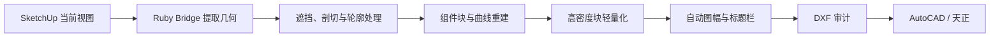

# SU2CAD

将 Windows 桌面版 SketchUp 当前视图转换为轻量、可编辑、真尺寸的 AutoCAD DXF 平面线稿。

SU2CAD 通过本地 SketchUp Ruby Bridge 读取模型几何，不调用 SketchUp 原生 DWG/DXF 导出器。它会按当前相机方向进行正交投影、处理遮挡和剖切、保留组件块，并自动生成适合图形方向与大小的 A 系列图框。

## 主要功能

- 当前视图转 1:1 毫米模型空间 DXF
- 透视视图自动转为同方向正交投影
- 过滤隐藏标签、隐藏实体和非轮廓柔化网格边
- 根据视线遮挡裁剪普通线段
- 支持活动剖切面与真实截交线
- 共线片段合并，圆弧、圆、样条和多段线保持为 CAD 曲线
- SketchUp 组件和合适尺寸的组保留为 CAD 块
- 植物块统一放入 `SU-PLANTS-BLOCKS` 图层
- 高密度植物、雕塑和装饰块自动轻量化
- 自动添加总宽、总高尺寸
- 自动判断横版或竖版，并从 A4、A3、A2、A1、A0 中选择图幅
- 自动创建双边框、底部标题栏、比例、单位和纸空间视口
- 生成后执行 DXF 审计，并可自动在 AutoCAD 或天正中打开

## 工作流程



## 环境要求

- Windows 10 或 Windows 11
- PowerShell 7
- SketchUp 2026 Desktop
- Python 3.10 或更高版本
- AutoCAD 2025，或基于 AutoCAD 2025 的天正 T30
- 已安装并启动本地 Codex SketchUp Bridge

Bridge 默认位置：

```text
%APPDATA%\SketchUp\SketchUp 2026\SketchUp\Plugins\codex_sketchup_bridge\main.rb
```

本地服务健康检查地址：

```text
http://127.0.0.1:8765/health
```

## 安装

将仓库克隆到 Codex 技能目录：

```powershell
git clone https://github.com/orangewoker/su2cad.git "$env:USERPROFILE\.codex\skills\su2cad"
```

安装 Python 依赖：

```powershell
python -m pip install -r "$env:USERPROFILE\.codex\skills\su2cad\requirements.txt"
```

重新打开 Codex 任务后，可通过 `$su2cad` 显式调用。

## 使用

1. 在 SketchUp 中打开模型并调整到需要导出的视图。
2. 确保 SketchUp Bridge 已启动。
3. 保持 AutoCAD 或天正处于打开状态。
4. 在 Codex 中要求使用 `$su2cad` 导出当前视图。

也可以直接运行：

```powershell
pwsh -NoProfile -File "$env:USERPROFILE\.codex\skills\su2cad\scripts\export_and_open.ps1"
```

默认输出目录：

```text
%USERPROFILE%\Desktop\SketchUp-CAD
```

## 命令参数

| 参数 | 默认值 | 说明 |
| --- | --- | --- |
| `-OutputDirectory <path>` | 桌面 `SketchUp-CAD` | 指定输出目录 |
| `-NoOpen` | 关闭 | 只生成和审计，不打开 CAD |
| `-NoDimensions` | 关闭 | 不生成总尺寸 |
| `-DisableOcclusion` | 关闭 | 跳过射线遮挡判断，用于诊断或超大模型 |
| `-IncludeHiddenSectionEdges` | 关闭 | 输出完整剖切边，可能产生杂线 |
| `-MaxBlockLines <count>` | `2500` | 每个高密度块保留的代表线数量，`0` 表示不优化 |
| `-PaperSize <AUTO\|A0\|A1\|A2\|A3\|A4>` | `AUTO` | 自动或固定标准图幅，方向仍由图形比例决定 |

示例：生成固定 A3 图幅但不自动打开 CAD：

```powershell
pwsh -NoProfile -File "$env:USERPROFILE\.codex\skills\su2cad\scripts\export_and_open.ps1" `
  -PaperSize A3 `
  -NoOpen
```

## 自动图框

- 宽度大于或等于高度时生成横版布局，例如 `A3-L`。
- 高度大于宽度时生成竖版布局，例如 `A4-P`。
- `AUTO` 会结合图形尺寸和常用建筑比例，在 A4 至 A0 中选择最小可容纳图形与尺寸标注的图幅。
- 图框包含外边界、装订边、内边框、贯通式底部标题栏、项目名、比例、图幅方向与毫米单位。
- DXF 只保留 `Model` 和正式纸空间布局，不保留空白 `Layout1`。

## 轻量化策略

复杂植物和装饰模型经俯视投影后可能产生数十万条亚毫米网格线。SU2CAD 对高密度块执行：

1. 共线线段合并。
2. 删除打印比例下不可见的微小线段。
3. 按二维网格均匀保留代表线，避免细节集中在局部。
4. 保持块插入点、外包范围、图层、曲线和真实尺寸不变。

实际测试中，约 85 MB、39.9 万块内实体的 DXF 可缩减至约 18.5 MB、7.2 万块内实体。具体结果取决于模型复杂度和 `-MaxBlockLines` 设置。

## 输出结构

- `SU-*`：来自 SketchUp 标签的普通图层
- `SU-BLOCK_*`：组件或组的块参照图层
- `SU-PLANTS-BLOCKS`：植物块专用图层
- `SU-SUCAD-SECTION`：剖切交线
- `SUCAD-DIM`：总尺寸
- `SUCAD-FRAME`：纸空间图框与标题栏
- `SUCAD-VPORT`：不打印的纸空间视口边界

每次运行创建新的 JSON 与 DXF，不覆盖源 `.skp` 或已有 `.dwg`。

## 故障排查

### Bridge 无法连接

保持 SketchUp 打开，并在 SketchUp 中执行：

```text
Extensions > Codex Bridge > Start
```

然后访问 `http://127.0.0.1:8765/health` 确认返回成功。

### DXF 仍然较大

降低高密度块上限：

```powershell
pwsh -NoProfile -File "$env:USERPROFILE\.codex\skills\su2cad\scripts\export_and_open.ps1" `
  -MaxBlockLines 1000
```

### 透视视图尺寸与画面不同

DXF 必须具有统一真实比例，因此透视相机会保留方向和向上向量，但转换为正交投影。这是预期行为。

## 目录结构

```text
su2cad/
├── SKILL.md
├── README.md
├── requirements.txt
├── agents/
│   └── openai.yaml
├── references/
│   └── environment.md
└── scripts/
    ├── export_and_open.ps1
    ├── export_current_view.rb
    └── build_dxf.py
```

## 许可证

[MIT License](LICENSE)
